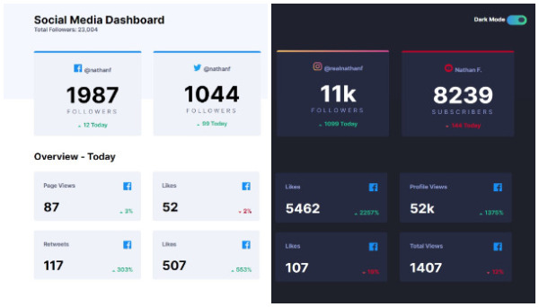

# Frontend Mentor - Dine Website Challenge solution

This is a solution to the [Social Media dashboard with theme switcher challenge on Frontend Mentor](https://www.frontendmentor.io/challenges/social-media-dashboard-with-theme-switcher-6oY8ozp_H). Frontend Mentor challenges help you improve your coding skills by building realistic projects. 

## Table of contents

  - [The challenge](#the-challenge)
  - [Screenshot](#screenshot)
  - [Links](#links)
  - [Built with](#built-with)
  - [What I learned](#what-i-learned)
  - [Author](#author)

### The challenge

Users should be able to:

- View the optimal layout for the site depending on their device's screen size
- See hover states for all interactive elements on the page
- Toggle color theme to their preference

### Screenshot



### Links

- Live Site URL: [View live page here](https://social-media-dashboard-with-theme-switcher-da-vi-de.vercel.app/)

### Built with

- Semantic HTML5 markup
- CSS custom properties
- Sass preprocessor
- Flexbox
- CSS Grid
- Vanilla Javascript

### What I learned

This was the first time i used a preprocessor, i feel quite statisfied but there's room for improvement.
I learned data html attribute along with a transition class in css and use them to trigger the dark mode in JS.

```
<html lang="en" data-theme="light">
```

```
 html[data-theme='dark'] {
    --color-bg: hsl(230, 17%, 14%);
    --color-bg-pattern: hsl(232, 19%, 15%);
    --color-card: hsl(228, 28%, 20%);
    --color-card-hover: hsl(228, 25%, 27%);
    --color-card-text: hsl(228, 34%, 66%);
    --color-headings-numbers: hsl(0, 0%, 100%);
  
  }

  html.transition,
  html.transition *,
  html.transition *:before,
  html.transition *:after {
      transition: all 750ms !important;
      transition-delay: 0 !important;
  }
```

### Useful resources

- [Dark mode toggle video](https://www.youtube.com/watch?v=ZKXv_ZHQ654) - This video helped me for implementing the dark mode toggle.

## Author

- Frontend Mentor - [@Da-vi-de](https://www.frontendmentor.io/profile/Da-vi-de)
